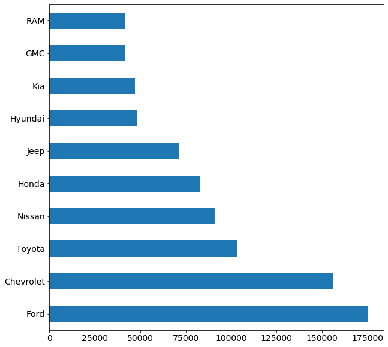
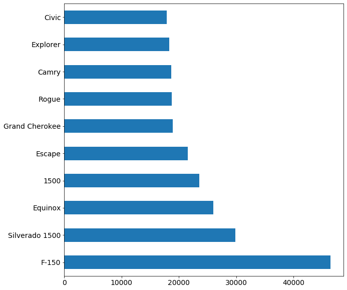
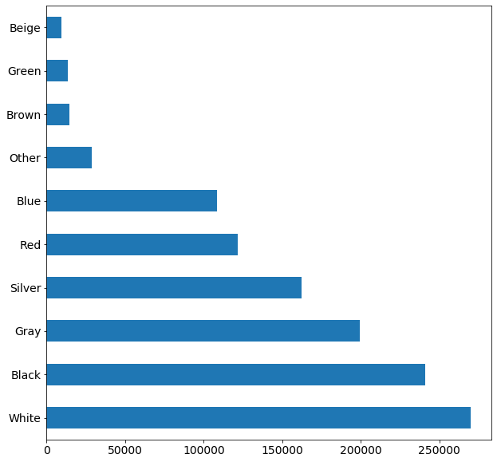

# Used Car Market Using Machine Learning

## Abstract
Cars.com has a huge selection of user- and dealership-submitted cars for sale. That, along with how easy it is to scrape, made it the ideal candidate for data collection.
The goal of this machine learning project is simply to:
* Train a model to predict the price of a car.

## Results
* Several models predicted car prices on unseen data much better than the baseline. Gradient Boosting gave the best result, with an RMSE of $8,396 against a baseline RMSE of $19,298 (always predicting the median price).
* These numbers come from `Code/model_comparison.ipynb`: a random 100,000-car sample with 10% held out for testing.

## Data
Cars.com was scraped with 20 scraper processes running in parallel, and the results were stored locally.
Each data point is a car for sale in the U.S. Cars.com refreshes the listings on its website every couple of days, so new data can be collected and added to the dataset.

## EDA
According to search results, the U.S. used car market saw about 40 million transactions in 2019, so the collected data was checked against the market's known distributions. The graphs below show the data.

* Make distribution (top 10)



* Model distribution (top 10)



* Color distribution (top 10)



## Model
The idea is to build a model that returns a price for a car, given its features. The data was tested on a few different types of machine learning models. Gradient Boosting performed best compared with the baseline RMSE (the median price). The neural network is still a work in progress.

### Output
The model outputs a price in U.S. dollars. Listings under $500 or over $500,000 are treated as data-entry errors and removed when cleaning.

### Features
* Year (as age)
* Make
* Model
* Mileage
* City
* State
* Body Style
* Color

## Repository layout
| Path | Purpose |
| --- | --- |
| `Code/scraper.py` | Scrapes cars.com search results (`/shopping/results/`) across a range of zip codes, in parallel worker processes |
| `Code/car_utils.py` | Shared helpers: `load_raw`, `clean` (dedup, outlier filter, age) and `evaluate` (RMSE, MAE, R², baseline) |
| `Code/combining_data.ipynb` | Combines the scraped CSVs into one dataset |
| `Code/EDA_ploting.ipynb`, `Code/cars_manipulation.ipynb` | Exploratory analysis and plots |
| `Code/model_comparison.ipynb`, `Code/gradientboost.ipynb` | Linear, random forest and gradient boosting models |
| `Code/neural_net.ipynb` | Neural network experiment (work in progress) |
| `gbr.pkl`, `rfr.pkl` | Trained gradient boosting and random forest models |
| `tests/` | Sanity tests |

## Reproducing
```bash
pip install -r requirements.txt

# 1. Scrape (needs a zip code list CSV with a `zip` column, e.g. a US zip code database export)
cd Code
python scraper.py --check 10001 --save-html page.html   # confirm parsing works on the live site first
python scraper.py --zip-codes zip_code_database.csv --zip-start 10000 --zip-end 100000 --workers 20 --out-dir .

# 2. Clean and evaluate, e.g. in a notebook:
#    from car_utils import load_raw, clean, evaluate
#    cars = clean(load_raw('carlist*.csv'))

# 3. Sanity tests (from the repo root)
python -m pytest tests
```

`--check` prints how many listings were parsed and how often each field was found. If cars.com changes its page layout again, save a results page from your browser and run `python scraper.py --parse-file page.html` to see what still parses. If the site starts serving bot checks, each worker logs it and stops instead of retrying. If `--check` reports 0 listings on a page that shows cars in your browser, the listings are probably rendered by JavaScript, and the scraper would need a headless browser such as Playwright.

Scraped CSVs are git-ignored. Please respect cars.com's terms of service and keep the request delay reasonable.

**Note on the `.pkl` models:** they were saved with scikit-learn 0.22.1 and do not load in current scikit-learn releases. To use them, install `scikit-learn==0.22.1` (Python 3.8 or older), or retrain.
