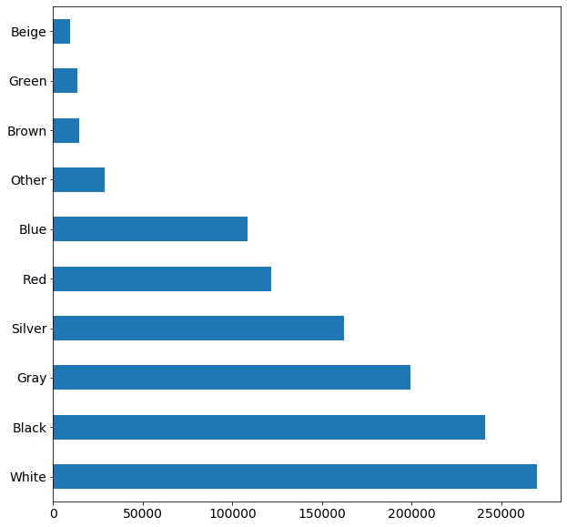

# Used Car Market Using Machine Learning

## Abstract
Cars.com (Cars) has a huge selection of user and dealrship submitted cars for sale, this as well as it's ease of scrapping made it the ideal candidit for data collection.
Goal of this Machine Learning Project is simply:
* Train a model to predict the price of a car.

## Results
* a number of models predicted the price of car pretty well on unseen data compared to the average. Gradient Boosting yielded the best results with an RMSE of 8,396. RMSE of the model base is 19,298 nueral network is a work in progress. 

## Data
Cars was scraped using 20 scrapper programs running in parrlel and stored locally on a M.2 Form Factor. 
Each datapoint represents a unique car being sold in the U.S. Cars.com refreshes the cars being shown on thier website every couple of days. As such new data could be collected and added to total data set.

## EDA
In 2019 the used car market saw 40 million transactions, according to search results, as such the data being collected needed to me examended to the known distributions for the market. See below for graphs on data

* Make Distribtion on the top 10

* Model Distribtion on the top 10

* Color Distribtion on the top 10

## Model
The general Idea is to build a model that returns a price for car given inputed feature information. Data was tested on a few different type of machine learning models. Random Forest Regressor as well as Gradient Boosting preformed around the same RMSE when compared to the baseline RMSE (average).

### Output
The output for the machine learning model is simple, prices can range from $1,000.00 - $100,000,000.00

### Features
* Year
* Make
* Model
* Milage
* City
* State
* Body Style
* Color
